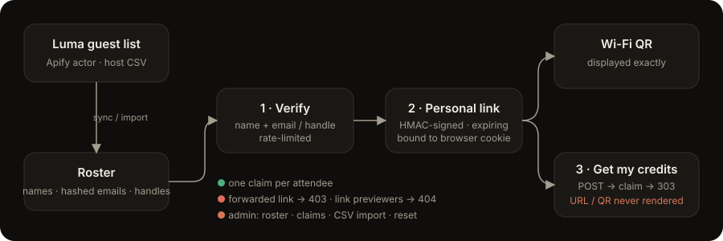

# Luma Event Keys Dispenser

One-time, per-attendee access links for event giveaways (API credits, promo codes) — gated on **verified Luma registration**, so a shared promo link stops being a free-for-all.

Built during the Bhopal **Claude Code Build Day – Fable 5.1** after watching a credits giveaway get burned by people forwarding the promotion link.

<p align="center">
  
</p>

## The problem

At meetups, organisers often hand out a promo QR / link (Wi-Fi, API credits, coupons). The moment it's on a screen, it's in a group chat — and the sponsor's budget is gone before registered attendees get to it. Luma has no built-in way to hand something *personal* to each approved guest.

## What this does

1. **Roster**: pulls the event's approved guest list from Luma — via the [`forkoff/luma-get-attendees`](https://apify.com/forkoff/luma-get-attendees) Apify actor, or by importing the host dashboard's Guests CSV.
2. **Verify**: an attendee enters their name as on Luma, plus (when needed) the email they registered with / their Luma username / a social handle from their profile.
3. **Personal link**: on success they get an HMAC-signed, expiring link that's **bound to their browser** — forwarding it to a friend yields a 403.
4. **Access page**: shows the **Wi-Fi QR exactly as provided**, and a *Get my credits* button.
5. **Hidden redirect**: the button is a `POST` that records the claim and `303`-redirects to the promo URL. The promo URL and QR are **never rendered**; `GET` on the redirect route is a 404 so WhatsApp/Slack link previewers can't burn a claim. **One claim per attendee** (with a short grace window for reloads).
6. **Admin**: live roster + claims, re-sync from Luma, CSV import, reset a claim, export claims CSV.

### What it deliberately does *not* promise

A browser redirect can't hide the final destination — once redirected, the promo URL is in the address bar. What this gives you is control over **who** gets there and **how many times**. If the promo is a single shared code, a determined attendee can still copy it afterwards; the gate just makes that the exception instead of the default.

## Verification model

Luma exposes different data depending on who's asking:

| Source | Fields available | Verification strength |
|---|---|---|
| Host CSV export (`Guests → Export`) | name, **email**, approval status, socials | **Strong** — name + registered email |
| Apify actor with a **host/manager** cookie | name, username, socials (no email) | Medium — name + Luma username/handle |
| Apify actor with an **attendee** cookie | same, but only if the host has *Show guest list* on | Medium, and often 403 |

Emails are never stored in clear — only a salted SHA-256 hash used for matching. `REQUIRE_HANDLE` controls strictness:

- `when_available` (default) — a second factor is required if the attendee's record has any email/username/handle, or if the name is ambiguous
- `always` — always require the second factor
- `never` — name only (not recommended)

Name matching is diacritic-insensitive, order-insensitive, and tolerates middle names.

## Quick start

```bash
git clone https://github.com/sachmeetsb/Claude-Build---Luma-Event-Keys-Dispenser.git
cd Claude-Build---Luma-Event-Keys-Dispenser
npm install
cp .env.example .env         # fill in PROMO_URL, LINK_SECRET, ADMIN_KEY (see below)
cp your-wifi-qr.png assets/wifi.png   # git-ignored; assets/wifi.placeholder.png is a dummy for testing
npm run import samples/guests.sample.csv   # or your Luma host export
npm start                     # http://localhost:3000  ·  admin: /admin?key=$ADMIN_KEY
```

Generate secrets:

```bash
echo "LINK_SECRET=$(openssl rand -hex 32)"
echo "ADMIN_KEY=$(openssl rand -hex 16)"
```

Get the promo URL out of a QR image without ever displaying it:

```bash
python3 -c "import cv2,sys;print(cv2.QRCodeDetector().detectAndDecode(cv2.imread(sys.argv[1]))[0])" promo.png
```

## Configuration

| Variable | Required | Description |
|---|---|---|
| `PROMO_URL` | yes | Destination behind the one-time redirect. Never rendered. |
| `LINK_SECRET` | yes | ≥16 chars. Signs links and salts email hashes. Rotating it invalidates all outstanding links. |
| `ADMIN_KEY` | yes | ≥12 chars. `/admin?key=…` |
| `LUMA_EVENT_URL` | for sync | e.g. `https://luma.com/abc123?tk=…` (invite token is used if present) |
| `APIFY_TOKEN` | for sync | Apify API token. Actor is pay-per-event: **$0.012 / attendee / run**. |
| `LUMA_COOKIE` | for sync | `luma.auth-session-key` cookie of an account that can see the guest list (host/manager, or attendee if the list is public) |
| `ROSTER_CSV` | no | Path to a CSV to seed the roster on first boot |
| `REQUIRE_HANDLE` | no | `when_available` (default) · `always` · `never` |
| `SYNC_INTERVAL_MIN` | no | Re-sync from Apify every N minutes (default 10; `0` disables). Skipped automatically when the roster came from CSV. |
| `SYNC_ON_BOOT` | no | `1` to force an Apify sync on every boot |
| `RECLAIM_GRACE_SEC` | no | Seconds after a claim during which the same device may re-trigger the redirect (default 180) |
| `EVENT_NAME`, `WIFI_SSID`, `WIFI_PASSWORD` | no | Display only |
| `DATA_DIR` | no | Where `roster.json` / `claims.json` live (default `./data`; `/data` in Docker) |

### CSV format

Any CSV with a `name` (or `first_name`/`last_name`) column works. Recognised optional columns: `email`, `username`, `twitter`/`x`, `linkedin`, `instagram`, `tiktok`, `youtube`, `api_id`, `approval_status`. Rows whose `approval_status` isn't `approved`/`going`/`checked_in` are skipped unless you untick *only approved*. `samples/guests.sample.csv` mirrors Luma's host export shape with synthetic data.

## Routes

| Method | Path | Purpose |
|---|---|---|
| `GET` | `/` | Verify form |
| `POST` | `/verify` | Match against roster → `303 /a/:token` (rate-limited 15 / 10 min / IP) |
| `GET` | `/a/:token` | Access page: Wi-Fi QR + claim button. Requires the cookie that verified. |
| `POST` | `/go/:token` | Record claim, `303 PROMO_URL`. Single-use. `GET` → 404. |
| `GET` | `/wifi.png` | The Wi-Fi QR image |
| `GET` | `/health` | `{ ok, roster }` |
| `GET` | `/admin?key=` | Dashboard |
| `POST` | `/admin/sync?key=` | Run the Apify actor now |
| `POST` | `/admin/import?key=` | Upload a guest CSV (multipart, field `csv`) |
| `POST` | `/admin/reset?key=` | Reset one attendee's claim (`id`) |
| `GET` | `/admin/claims.csv?key=` | Export claims |

## Deploy

Dockerfile + `railway.toml` included. On [Railway](https://railway.com): create a service from this repo, attach a **volume at `/data`** (claims must survive restarts), set the env vars, and generate a domain. Then either seed via `ROSTER_CSV` or upload a CSV from `/admin`.

Anything that runs a container works the same way — the only state is two JSON files in `DATA_DIR`. It's designed for a single instance (in-memory rate limiter, file-backed store); that's plenty for an event.

## Project layout

```
server.js            Express app, routes, rate limiting, boot/seed/sync
lib/roster.js        Apify sync · CSV import · normalisation · matching
lib/tokens.js        HMAC-signed, expiring, cookie-bound links
lib/store.js         Atomic JSON persistence
views/               Server-rendered HTML (no client JS)
scripts/import-csv.js
samples/guests.sample.csv
```

## Getting the Luma guest list (when the actor 403s)

If the actor fails with *"Not authorized for this guest list (403)"*, the event has **Show guest list** turned off and your cookie isn't a host's. You'll need one of:

- the host to export **Guests → CSV** and share it (best — includes emails), or
- the host to add you as a **manager** on the event, or
- the host to enable **Show guest list** (weaker: every attendee can then see the roster).

## License

MIT

## Demo

https://github.com/sachmeetsb/Claude-Build---Luma-Event-Keys-Dispenser/raw/main/docs/demo.mp4

(synthetic roster; promo destination replaced by a dummy sponsor page)
